# LIF Microservices Overview

## Understanding LIF as Building Blocks

LIF (Learner Information Framework) provides infrastructure components for building custom learner data workflows—not a one-size-fits-all product. Think of these microservices as building blocks that can be composed to create tailored solutions for aggregating, transforming, and accessing learner information across multiple systems and institutions.

Each service addresses a specific responsibility in the learner data ecosystem. Organizations typically use a subset of these services based on their specific integration and analytics needs.

### High-Level Architecture

```mermaid
graph TB
    subgraph External["External Systems & Users"]
        Users[🌐 Applications/<br>👤 Developers]
        Students[🎓 Students/Learners]
        Sources[🏢 Source Systems<br/>SIS, LMS, HR]
        Orchestrators[⚙️ Dagster/Airflow]
        AIModels[🤖 AI Models]
        AITools[🤖 AI Tools<br/>Claude, Cursor]
        Adapters[🔌  Adapters]
    end
    
    subgraph Core["Core Data Services"]
        GQL[GraphQL API]
        Trans[Translator]
        IDMap[Identity Mapper]
        MDR[MDR Service]
        MDRUI[MDR UI]
    end
    
    subgraph Intel["Intelligence Layer"]
        Advisor[Advisor API]
        AdvisorUI[Advisor UI]
        MCP[Semantic Search<br/>MCP Server]
    end
    
    subgraph Infra["Infrastructure Services"]
        Cache[Query Cache]
        Planner[Query Planner]
        Orch[Orchestrator API]
    end
    
    Users --> GQL
    Users --> MDRUI
    Students --> AdvisorUI
    AITools --> MCP
    
    GQL --> Planner
    GQL --> MDR
    AdvisorUI --> Advisor
    Advisor --> GQL
    Advisor --> MCP
    Advisor --> AIModels
    MCP --> GQL
    MCP --> MDR
    MDRUI --> MDR
    
    Planner --> Cache
    Planner --> IDMap
    Planner --> Orch
    
    Orch --> Orchestrators
    Orchestrators --> Trans
    Orchestrators --> Adapters
    Adapters --> Sources
    Trans --> MDR
    
    classDef coreStyle fill:#4A90E2,stroke:#2E5C8A,color:#fff
    classDef intelStyle fill:#7ED321,stroke:#5FA319,color:#fff
    classDef infraStyle fill:#F5A623,stroke:#C17D11,color:#fff
    classDef extStyle fill:#9B9B9B,stroke:#6B6B6B,color:#fff
    
    class GQL,Trans,IDMap,MDR,MDRUI coreStyle
    class Advisor,AdvisorUI,MCP intelStyle
    class Cache,Planner,Orch infraStyle
    class Users,Students,Sources,Orchestrators,AITools extStyle
```

---

## Core Data Services

These services handle the fundamental data operations: querying, transformation, identity resolution, and metadata management.

### 🔍 LIF GraphQL API

**WHEN YOU NEED TO...**  
Provide a standardized query interface for accessing learner data across multiple source systems using a flexible, modern API.

**THIS SERVICE...**  
Exposes learner data through a GraphQL interface, routing queries to the Query Planner to fetch data in the LIF data model format.

```mermaid
graph LR
    GQL[LIF GraphQL API]
    QP[Query Planner]
    MDR[MDR Service]
    subgraph Clients["Clients"]
        Users[🌐 External Applications]
        Advisor[Advisor API]
        MCP[Semantic Search]
    end
    
    Users -->|queries| GQL
    Advisor -->|queries| GQL
    MCP -->|queries| GQL
    GQL -->|get schema info| MDR
    GQL -->|query for LIF records| QP
    
    classDef coreStyle fill:#4A90E2,stroke:#2E5C8A,color:#fff
    classDef intelStyle fill:#7ED321,stroke:#5FA319,color:#fff
    classDef infraStyle fill:#F5A623,stroke:#C17D11,color:#fff
    classDef extStyle fill:#9B9B9B,stroke:#6B6B6B,color:#fff
    
    class GQL,MDR coreStyle
    class Advisor,MCP intelStyle
    class QP infraStyle
    class Users extStyle
```

**USE CASES:**
- Building dashboards that pull learner data from multiple systems
- Creating APIs for institutional data portals
- Developing custom analytics applications that need learner information
- Integrating learner data into third-party applications

**WORKS WITH:** Query Planner, MDR Service, Advisor API, Semantic Search MCP Server  
**TYPICAL USERS:** Application developers, data engineers

---

### 🔄 LIF Translator

**WHEN YOU NEED TO...**  
Transform data from your institution's systems (SIS, LMS, HR systems) into a standardized learner data format for integration and analysis.

**THIS SERVICE...**  
Converts data from various source formats into the LIF data model using configurable mappings, running within orchestrated data workflows.

```mermaid
graph LR
    Orch["🌐 Orchestration Tool<br/>Dagster / Airflow"]

    subgraph DAG["📐 LIF Ingest DAG"]
        Sources["🌐 Source Systems<br/>SIS, LMS, HR"]
        Adapter["Source Adapter"]
        Trans["Translator"]
    end

    MDR["MDR Service"]

    Sources -->|extract records| Adapter
    Adapter -->|pass source data| Trans
    Trans -->|emit LIF records| Orch
    Trans -->|get mappings| MDR

    classDef coreStyle fill:#4A90E2,stroke:#2E5C8A,color:#fff
    classDef extStyle fill:#9B9B9B,stroke:#6B6B6B,color:#fff
    classDef dagStyle fill:#2B2B2B,stroke:#6B6B6B,stroke-dasharray: 5 5,color:#E0E0E0

    class Adapter,Trans coreStyle
    class MDR coreStyle
    class Orch,Sources extStyle
    class DAG dagStyle
```

**USE CASES:**
- Importing student records from your SIS into a unified data warehouse
- Standardizing learning activity data from multiple LMS platforms
- Converting HR employment records into learner experience data
- Preparing data for cross-institutional credential exchanges

**WORKS WITH:** MDR Service (for mappings), Orchestrator API (runs in DAG workflows), Source Adapters  
**TYPICAL USERS:** Data engineers, ETL developers

---

### 👤 LIF Identity Mapper

**WHEN YOU NEED TO...**  
Match and link learner identities across different systems and institutions where the same person may have multiple IDs, email addresses, or identifying information.

**THIS SERVICE...**  
Resolves learner identities across systems and organizations, enabling accurate aggregation of records that belong to the same individual.

**USE CASES:**
- Connecting a student's community college records with their university records
- Linking learner identities across workforce training programs and educational institutions
- Merging records when students transfer between institutions
- Building comprehensive learner profiles from fragmented data sources

**WORKS WITH:** Query Planner (provides identity mappings for queries)  
**TYPICAL USERS:** Data stewards, integration architects

---

### 📋 LIF MDR (Metadata Repository) Service

**WHEN YOU NEED TO...**  
Define and manage how data from your source systems maps to the LIF data model, including schemas, field mappings, and transformation rules.

**THIS SERVICE...**  
Provides the backend for managing schemas, mapping configurations, and data translations used throughout the LIF ecosystem.

**USE CASES:**
- Configuring how your SIS fields map to standardized learner attributes
- Defining custom extensions to the LIF data model for institution-specific needs
- Managing data quality rules and validation logic
- Documenting data lineage and transformation logic

**WORKS WITH:** MDR UI (frontend), Translator, GraphQL API, Semantic Search  
**TYPICAL USERS:** Data architects, data governance teams

---

### 🖥️ LIF MDR UI

**WHEN YOU NEED TO...**  
Provide a user-friendly interface for data teams to configure mappings and manage metadata without writing code.

**THIS SERVICE...**  
Offers a web-based interface for configuring data mappings and managing the metadata repository.

```mermaid
graph LR
    Users[👤 Data Engineers<br/> 👤 Data Stewards]
    MDRUI[LIF MDR UI]
    MDR[MDR Service]
    
    Users -->|configure mappings| MDRUI
    MDRUI -->|CRUD operations| MDR
    
    classDef coreStyle fill:#4A90E2,stroke:#2E5C8A,color:#fff
    classDef extStyle fill:#9B9B9B,stroke:#6B6B6B,color:#fff
    
    class MDRUI,MDR coreStyle
    class Users extStyle
```

**USE CASES:**
- Visually mapping source system fields to LIF data model attributes
- Testing and validating data transformations before deployment
- Managing versioning of mapping configurations
- Training non-technical staff on data integration processes

**WORKS WITH:** MDR Service  
**TYPICAL USERS:** Data engineers, data stewards, business analysts

---

## Intelligence Layer

These services add AI and semantic capabilities on top of the core data infrastructure.

### 🤖 LIF Advisor API

**WHEN YOU NEED TO...**  
Build conversational interfaces that help users explore learner data, answer questions, or guide decision-making based on integrated learner information.

**THIS SERVICE...**  
Provides AI-powered advisory capabilities over learner data, enabling natural language interactions with complex educational and employment records.

**USE CASES:**
- "Student success advisor" chatbots for academic advisors
- Career guidance tools that analyze learner competencies and experiences
- Natural language querying of institutional data
- Personalized learning path recommendations based on prior learning
- Intervention suggestion engines for at-risk students

**WORKS WITH:** GraphQL API, Semantic Search MCP Server, Advisor UI, AI Models  
**TYPICAL USERS:** Student affairs, advising offices, EdTech product teams

---

### 💬 LIF Advisor UI

**WHEN YOU NEED TO...**  
Provide students or learners with a direct, conversational way to access and understand their educational and employment records.

**THIS SERVICE...**  
Offers a student-facing web interface for interacting with the AI-powered advisor.

```mermaid
graph LR
    Students[👤 Students<br/> 👤 Learners<br/> 👤 Alumni]
    AdvisorUI[LIF Advisor UI]
    Advisor[Advisor API]
    
    Students -->|ask questions| AdvisorUI
    AdvisorUI -->|send query| Advisor
    Advisor -->|AI response| AdvisorUI
    AdvisorUI -->|display answers| Students
    
    classDef intelStyle fill:#7ED321,stroke:#5FA319,color:#fff
    classDef extStyle fill:#9B9B9B,stroke:#6B6B6B,color:#fff
    
    class AdvisorUI,Advisor intelStyle
    class Students extStyle
```

**USE CASES:**
- Students asking "What courses do I need to graduate?"
- Learners exploring "What careers match my skills and experience?"
- Alumni reviewing their comprehensive learning history
- Job seekers understanding how to present their credentials to employers

**WORKS WITH:** Advisor API  
**TYPICAL USERS:** Students, learners, alumni

---

### 🔎 LIF Semantic Search MCP Server

**WHEN YOU NEED TO...**  
Enable AI tools and applications to discover and query learner data using natural language through the Model Context Protocol standard.

**THIS SERVICE...**  
Provides semantic search capabilities over learner data that can be accessed by MCP-compatible AI tools like Claude, Cursor, or custom AI applications.

**USE CASES:**
- Integrating learner data into AI development environments
- Enabling AI assistants to answer questions about student populations
- Building context-aware AI applications that understand learner records
- Creating custom AI tools that need semantic access to educational data

**WORKS WITH:** GraphQL API, MDR Service, Advisor API, AI Tools  
**TYPICAL USERS:** AI/ML developers, application developers integrating AI capabilities

---

## Infrastructure Services

These services provide the performance, optimization, and workflow orchestration necessary for production deployments.

### 💾 LIF Query Cache

**WHEN YOU NEED TO...**  
Improve query performance and reduce load on source systems by caching learner data fragments and creating unified learner records.

**THIS SERVICE...**  
Stores LIF data model fragments from various sources (with metadata) and creates merged aggregate records for each learner.

**USE CASES:**
- Reducing response times for frequently accessed learner profiles
- Minimizing impact on production source systems during high query volumes
- Pre-aggregating learner records for real-time applications
- Supporting offline or disconnected access to learner data

**WORKS WITH:** Query Planner (reads/writes cache)  
**TYPICAL USERS:** System administrators, platform engineers

---

### 🧠 LIF Query Planner

**WHEN YOU NEED TO...**  
Intelligently route queries, determine data freshness requirements, and orchestrate data collection from multiple upstream sources.

**THIS SERVICE...**  
Acts as the query intelligence layer, checking cache availability, consulting the Identity Mapper for additional learner identities, and orchestrating data collection workflows when needed.

**USE CASES:**
- Optimizing query execution across multiple data sources
- Determining when cached data is sufficient vs. when fresh data is needed
- Coordinating complex queries that require identity resolution
- Managing data collection workflows for missing or stale data

**WORKS WITH:** GraphQL API (receives queries), Query Cache, Identity Mapper, Orchestrator API  
**TYPICAL USERS:** Platform engineers, DevOps teams

---

### 🔧 LIF Orchestrator API

**WHEN YOU NEED TO...**  
Integrate with existing workflow orchestration tools to manage data collection pipelines from upstream source systems.

**THIS SERVICE...**  
Provides a facade to external orchestration products (Dagster, Apache Airflow), enabling the Query Planner to trigger data collection workflows.

```mermaid
graph LR
    QP[Query Planner]
    Orch[LIF Orchestrator API]
    OrchTools[🌐 Orchestration Tools<br/>Dagster, Airflow]

    subgraph DAG["📐 LIF Ingest DAG"]
        Sources["🌐 Source Systems<br/>SIS, LMS, HR"]
        Adapter["🔌  Source Adapter"]
        Trans["Translator"]
    end

    Sources -->|extract records| Adapter
    Adapter -->|pass source data| Trans
    Trans -->|emit LIF fragments| OrchTools
    QP -->|trigger collection| Orch
    Orch -->|start DAG| OrchTools
    OrchTools -->|run workflow| DAG
    OrchTools -->|returns LIF fragments| Orch
    Orch -->|returns LIF fragments| QP
    
    classDef infraStyle fill:#F5A623,stroke:#C17D11,color:#fff
    classDef coreStyle fill:#4A90E2,stroke:#2E5C8A,color:#fff
    classDef extStyle fill:#9B9B9B,stroke:#6B6B6B,color:#fff
    classDef dagStyle fill:#2B2B2B,stroke:#6B6B6B,stroke-dasharray: 5 5,color:#E0E0E0
    
    class Orch infraStyle
    class Trans,Adapter coreStyle
    class QP infraStyle
    class OrchTools,Sources extStyle
    class DAG dagStyle
```

**USE CASES:**
- Scheduling regular data imports from institutional systems
- Triggering on-demand data collection when cache misses occur
- Managing complex ETL pipelines that include translation steps
- Coordinating data freshness across multiple source systems

**WORKS WITH:** Query Planner API (triggers workflows), Translator (may be included in DAG workflows)  
**TYPICAL USERS:** Data engineers, DevOps teams, workflow administrators

---

## How These Services Work Together

### Standard Query Flow

```mermaid
graph TB
    User[🌐 External Application]
    GQL[GraphQL API]
    QP[Query Planner]
    Cache[Query Cache]
    MISS[Query Miss -- Start Data Collection Workflow]
    
    User -->|1. Request learner data| GQL
    GQL -->|2. Forward query| QP
    QP -->|3. Check cache| Cache
    Cache -->|4. Return LIF record or miss| QP
    Cache -->|4'. Data missing/stale| MISS
    QP -->|13. Return LIF data or collection ID| GQL
    GQL -->|14. Send results| User
    
    classDef coreStyle fill:#4A90E2,stroke:#2E5C8A,color:#fff
    classDef infraStyle fill:#F5A623,stroke:#C17D11,color:#fff
    classDef extStyle fill:#9B9B9B,stroke:#6B6B6B,color:#fff
    
    class GQL,Trans,IDMap coreStyle
    class QP,Cache,Orch infraStyle
    class User,OrchTool,Sources extStyle
```

### AI-Powered Advisor Flow

```mermaid
graph TB
    Student[🎓 Student/Learner]
    AdvisorUI[Advisor UI]
    Advisor[Advisor API]
    MCP[Semantic Search MCP Server]
    GQL[GraphQL API]
    AIModel[🤖 AI Models]
    QUERY[Standard Query Flow]
    
    Student -->|1. Ask question| AdvisorUI
    AdvisorUI -->|2. Send question| Advisor
    Advisor -->|3. Query basic learner data| GQL
    GQL -->QUERY
    GQL -->|4. Return basic learner data| Advisor
    Advisor -->|5. Request contextual LIF data| MCP
    MCP -->|6. Query LIF student record| GQL
    GQL -->|7. Return LIF student record| MCP
    MCP -->|8. Return contextual LIF data| Advisor
    Advisor -->|9. Pass to AI Model| AIModel
    AIModel -->|10. Return natural language response| Advisor
    Advisor -->|10. Natural language response| AdvisorUI
    AdvisorUI -->|11. Display answer| Student
    
    classDef coreStyle fill:#4A90E2,stroke:#2E5C8A,color:#fff
    classDef intelStyle fill:#7ED321,stroke:#5FA319,color:#fff
    classDef infraStyle fill:#F5A623,stroke:#C17D11,color:#fff
    classDef extStyle fill:#9B9B9B,stroke:#6B6B6B,color:#fff
    
    class GQL coreStyle
    class Advisor,AdvisorUI,MCP intelStyle
    class Student extStyle
```

### Data Collection & Translation Flow (Cache Miss)

```mermaid
graph TB
    subgraph Infra[Infrastructure Services]
        QP[Query Planner]
        Cache[Query Cache]
        Orch[LIF Orchestrator API]
    end
    subgraph DAG["📐 LIF Ingest DAG"]
        Adapter["🔌  Source Adapter"]
        Trans["Translator"]
    end
    subgraph Core[Core Data Services]
        MDR[MDR Service]
    end
    subgraph Ext[External Systems]
        OrchTool[🌐 Orchestration Tools<br/>Dagster, Airflow]
        Sources["🌐 Source Systems<br/>SIS, LMS, HR"]
    end
    
    QP -->|1. Query for LIF record| Cache
    Cache -->|2. cache miss/expired| QP
    QP -->|3. Trigger collection| Orch
    Orch -->|4. Signal to start DAG| OrchTool
    OrchTool -->|5. Start DAG with<br/>learner identities| DAG
    Adapter -->|6. Extracts source records| Sources
    Adapter -->|7. Passes source records| Trans
    Trans -->|8. Get mappings| MDR
    MDR -->|9. Return mappings| Trans
    Trans -->|10. Transform to LIF format| Trans
    Trans -->|11. Emits LIF fragments| OrchTool
    OrchTool -->|12. Submits LIF fragments via callback| QP
    QP -->|13. Submits fresh LIF fragments| Cache
    Cache -->|14. Merge into<br/>aggregate record| Cache
    
    classDef coreStyle fill:#4A90E2,stroke:#2E5C8A,color:#fff
    classDef infraStyle fill:#F5A623,stroke:#C17D11,color:#fff
    classDef extStyle fill:#9B9B9B,stroke:#6B6B6B,color:#fff
    classDef dagStyle fill:#2B2B2B,stroke:#6B6B6B,stroke-dasharray: 5 5,color:#E0E0E0

    
    class Trans,MDR,Adapter coreStyle
    class QP,Orch,Cache infraStyle
    class OrchTool,Sources extStyle
    class DAG dagStyle
```

---

## Composing Solutions

Not every organization needs all services. Here are common deployment patterns:

**Simple Integration Pattern:**  
GraphQL API + Query Planner + Query Cache + Translator + MDR (API & UI)
- For organizations that want to standardize and query their learner data

**Advanced Analytics Pattern:**  
Add: Identity Mapper + Orchestrator API
- For multi-institutional scenarios requiring identity resolution and complex workflows

**AI-Enhanced Pattern:**  
Add: Advisor (API & UI) + Semantic Search MCP
- For organizations building AI-powered student services

**Full Platform:**  
All services
- For comprehensive learner data platforms serving multiple use cases
